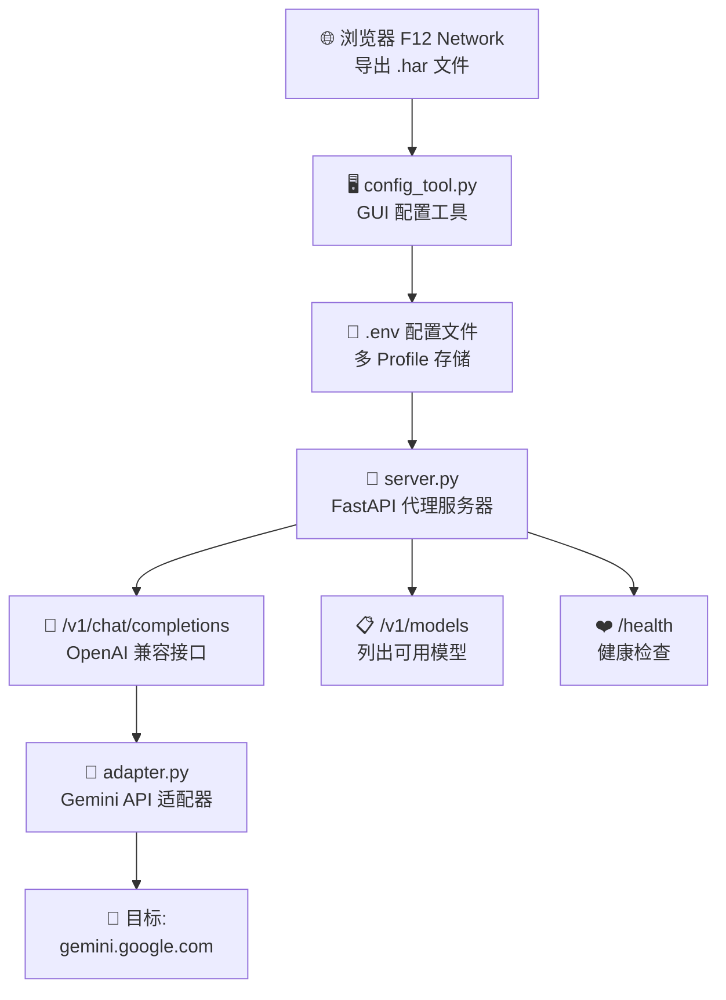

<p align="center">
  
  
  
  
</p>

<h1 align="center">✨ Gemini2API</h1>
<p align="center"><b>将 Google Gemini 网页版逆向为 OpenAI 兼容 API · 支持多模型切换</b></p>

<p align="center">
只需从浏览器导出一个 <code>.har</code> 文件，即可自动提取认证参数，<br>
启动一个支持多模型、多思考模式的 OpenAI 兼容代理服务器。
</p>

<br>

---

## 📋 目录

- [✨ 特性](#-特性)
- [🔧 原理](#-原理)
- [🚀 快速开始](#-快速开始)
  - [前置条件](#前置条件)
  - [1. 捕获 HAR 文件](#1-捕获-har-文件)
  - [2. 运行配置工具](#2-运行配置工具)
  - [3. 一键启动](#3-一键启动)
  - [4. 使用 API](#4-使用-api)
- [📁 项目结构](#-项目结构)
- [⚙️ 配置说明](#️-配置说明)
- [🧠 模型与思考模式](#-模型与思考模式)
- [🔄 认证参数过期处理](#-认证参数过期处理)
- [⚠️ 注意事项](#️-注意事项)
  - [已知限制](#已知限制)
  - [常见问题](#常见问题)
- [📄 License](#-license)
- [⚖️ 免责协议](#️-免责协议)

---

## ✨ 特性

| 特性 | 支持 | 说明 |
|:-----|:----:|:-----|
| OpenAI 兼容 API | ✅ | `/v1/chat/completions` + `/v1/models` |
| 多模型切换 | ✅ | 通过 `model` 字段任意切换 |
| 思考模式切换 | ✅ | 标准 / 进阶思考 |
| GUI 配置工具 | ✅ | 图形化操作，无需手写配置 |
| 多 Profile 配置 | ✅ | 各模型独立凭证，互不干扰 |
| 一键启动 | ✅ | `start.bat` 双击即用 |
| 流式输出 | ✅ | SSE 流式支持 |
| 健康检查 | ✅ | `/health` 端点 |

---

## 🔧 原理



> **一句话原理**：配置工具从 HAR 提取认证参数 → 存入 `.env` → 代理服务器读取 `.env` 并转发请求到 Gemini，同时将响应转换为 OpenAI 格式。

---

## 🚀 快速开始

### 前置条件

- [x] Python 3.10+
- [x] Google 账号（已登录 Gemini）
- [x] Chrome / Edge 浏览器

```bash
pip install fastapi uvicorn httpx python-dotenv pydantic
```

---

### 1. 捕获 HAR 文件

> [!TIP]
> 每个模型需要**单独捕获一次** HAR 文件。例如 3.5 Flash 一次、3.1 Flash Lite 一次。

<details>
<summary><b>📸 详细步骤（点击展开）</b></summary>

1. 打开 Chrome，按 **`F12`** 进入 DevTools
2. 切换到 **Network** 面板
3. ✅ 勾选 **Preserve log**（保留日志）
4. 访问 [https://gemini.google.com](https://gemini.google.com)，**确保已登录**
5. 在 Gemini UI 中选择你想要使用的模型（如 Gemini 3.5 Flash）
6. 发送一条聊天消息，等待 AI 回复完成
7. 在 Network 面板中 **右键任意请求**
8. 选择 **Save all as HAR with content**
9. 保存为 `.har` 文件

</details>

---

### 2. 运行配置工具

```bash
python config_tool.py
```

| 步骤 | 操作 | 说明 |
|:----:|:-----|:-----|
| ① | 点击 **浏览...** | 选择上一步保存的 `.har` 文件 |
| ② | 填写 **模型名** | 如 `gemini-3.5-flash` |
| ③ | 点击 **解析** | 自动提取认证参数 + JSPB 模型信息 |
| ④ | 点击 **保存到 .env** | 写入对应 Profile |
| ⑤ | 切换 HAR 文件 | 换一个模型，重复 ①~④ |

> [!NOTE]
> 工具会自动识别 `model_family` 和 `thinking_mode`，并提示建议的模型名。

---

### 3. 一键启动

```bash
start.bat
```

或手动启动：

```bash
python server.py 1800
```

服务器默认运行在 **`http://localhost:1800`**。

<details>
<summary><b>验证服务器是否正常运行</b></summary>

```bash
curl http://localhost:1800/health
# 预期响应: {"status":"ok","model":"gemini-3.5-flash","profiles":["gemini-3.5-flash",...]}
```

```bash
curl http://localhost:1800/v1/models
# 预期响应: {"object":"list","data":[{"id":"gemini-3.5-flash",...}]}
```

</details>

---

### 4. 使用 API

#### Python (OpenAI SDK)

```python
from openai import OpenAI

client = OpenAI(
    base_url="http://localhost:1800/v1",
    api_key="sk-web2api-placeholder",  # 任意值即可
)

# 列出可用模型
models = client.models.list()
print([m.id for m in models.data])
# ➜ ['gemini-3.5-flash', 'gemini-3.5-flash-adv', 'gemini-3.1-flash-lite', ...]

# 3.5 Flash 标准思考
resp = client.chat.completions.create(
    model="gemini-3.5-flash",
    messages=[{"role": "user", "content": "Hello"}],
)
print(resp.choices[0].message.content)

# 3.5 Flash 进阶思考（只需换 model 名）
resp = client.chat.completions.create(
    model="gemini-3.5-flash-adv",
    messages=[{"role": "user", "content": "Hello"}],
)
```

#### cURL

```bash
# 3.5 Flash 标准思考
curl -s http://localhost:1800/v1/chat/completions \
  -H "Content-Type: application/json" \
  -d '{"model":"gemini-3.5-flash","messages":[{"role":"user","content":"Hello"}]}'

# 3.5 Flash 进阶思考
curl -s http://localhost:1800/v1/chat/completions \
  -H "Content-Type: application/json" \
  -d '{"model":"gemini-3.5-flash-adv","messages":[{"role":"user","content":"Hello"}]}'

# 3.1 Flash Lite 标准思考
curl -s http://localhost:1800/v1/chat/completions \
  -H "Content-Type: application/json" \
  -d '{"model":"gemini-3.1-flash-lite","messages":[{"role":"user","content":"Hello"}]}'
```

#### Claude Code

```bash
set OPENAI_API_BASE=http://localhost:1800/v1
set OPENAI_API_KEY=sk-web2api-placeholder
claude
```

---

## 📁 项目结构

```
Gemini2API/
├── 🖥️  config_tool.py      # GUI 配置工具（选择 HAR → 解析 → 保存 .env）
├── 🚀  server.py           # FastAPI 代理服务器
├── 🧩  adapter.py          # Gemini API 适配器（多 Profile 架构）
├── 📄  har_parser.py       # HAR 文件解析器（含 JSPB 提取）
├── 🏁  start.bat           # 一键启动脚本
├── 🔒  .env                # 配置文件（自动生成，含敏感信息）
├── 📋  .env.example        # 配置模板
├── 📖  README.md           # 本文件
└── 📜  LICENSE             # Unlicense 公有领域
```

---

## ⚙️ 配置说明

`.env` 文件分为 **服务器配置** 和 **多 Profile** 两段：

```ini
# ============================================
# 服务器配置
# ============================================
HOST=0.0.0.0
PORT=1800
API_KEY=sk-web2api-placeholder
MODEL_NAMES=gemini-3.5-flash,gemini-3.5-flash-adv,gemini-3.1-flash-lite
DEFAULT_MODEL=gemini-3.5-flash

# ============================================
# Profile: gemini-3.5-flash
# ============================================
MODEL_FAMILY_gemini-3.5-flash=1        # 1=Flash, 6=Flash Lite
THINKING_MODE_gemini-3.5-flash=1       # 1=标准, 2=进阶
F_SID_gemini-3.5-flash=xxx
AT_gemini-3.5-flash=xxx
SN_PARAM_gemini-3.5-flash=xxx
BL_PARAM_gemini-3.5-flash=xxx
HL_gemini-3.5-flash=zh-CN
UUID_gemini-3.5-flash=xxx
HASH_gemini-3.5-flash=xxx

# ============================================
# Profile: gemini-3.5-flash-adv
# ============================================
MODEL_FAMILY_gemini-3.5-flash-adv=1
THINKING_MODE_gemini-3.5-flash-adv=2    # 进阶思考
...
```

| 字段 | 格式 | 说明 |
|:-----|:-----|:-----|
| `MODEL_FAMILY_<name>` | `1` / `6` | 1=Flash, 6=Flash Lite |
| `THINKING_MODE_<name>` | `1` / `2` | 1=标准, 2=进阶 |
| `F_SID_<name>` | 数字串 | 会话 ID |
| `AT_<name>` | 令牌串 | 认证令牌 |
| `SN_PARAM_<name>` | 加密串 | SN 令牌 |
| `UUID_<name>` | UUID | 会话 UUID（JSPB） |
| `HASH_<name>` | 哈希串 | 请求哈希（JSPB） |

> [!IMPORTANT]
> 每个 Profile 使用 `_模型名` 后缀区分，互不干扰。配置工具只更新对应 Profile，不动其他 Profile。

---

## 🧠 模型与思考模式

### JSPB 字段释义

| 数组索引 | 含义 | 可选值 |
|:--------:|:-----|:-------|
| `[14]` | **模型家族** | `1` = Flash 系列 · `6` = Flash Lite 系列 |
| `[15]` | **思考模式** | `1` = 标准思考 · `2` = 进阶思考 / 扩展思考 |

### 推荐模型命名

| 模型家族 | 思考模式 | 推荐模型名 |
|:---------|:---------|:-----------|
| Flash | 标准 | `gemini-3.5-flash` |
| Flash | 进阶 | `gemini-3.5-flash-adv` |
| Flash Lite | 标准 | `gemini-3.1-flash-lite` |
| Flash Lite | 进阶 | `gemini-3.1-flash-lite-adv` |

> [!TIP]
> 模型名是自由的——你想叫什么就叫什么，只要 `.env` 中有对应 Profile 即可。

---

## 🔄 认证参数过期处理

| 参数 | 有效期 | 说明 |
|:-----|:------|:-----|
| `at` | ⏳ 数小时 | 会话级别，过期最快 |
| `f.sid` | 📅 数天 | 会话 ID |
| `sn_param` | 🔄 每次响应刷新 | 加密令牌，旧值仍可用一段时间 |
| `bl` | 📆 版本更新时 | 构建版本号 |

**过期处理流程：**

```
浏览器 F12 → 保存 HAR → 运行 config_tool.py → 
填入相同模型名 → 点击保存 → 重启服务器
```

整个过程无需手动编辑 `.env`。

---

## ⚠️ 注意事项

### 已知限制

- [ ] 仅支持**文本对话**，不支持多模态（图片/文件）
- [ ] 需要在 Gemini 网页端**选择好模型后**再捕获 HAR
- [ ] 每个模型有**独立的认证凭证**，不可混用
- [ ] 不支持工具调用（function calling）

### 常见问题

<details>
<summary><b>Q: 返回 502 Bad Gateway</b></summary>

认证参数过期。重新捕获 HAR 文件并用配置工具更新。
</details>

<details>
<summary><b>Q: 如何添加新模型？</b></summary>

1. 在 Gemini 网页切换到该模型 → 发送消息 → 导出 HAR
2. 运行 `config_tool.py` → 选择 HAR → 填入模型名 → 保存
</details>

<details>
<summary><b>Q: 如何更改端口？</b></summary>

直接编辑 `.env` 中的 `PORT=` 行，重启服务器即可。
</details>

<details>
<summary><b>Q: 服务器启动报错端口被占用？</b></summary>

```bash
# 查看谁占了端口
netstat -ano | findstr ":1800"
# 杀掉占用进程（替换 PID）
taskkill /PID <PID> /F
# 或改到其他端口
# 编辑 .env 中的 PORT=1801
```
</details>

<details>
<summary><b>Q: 支持 Claude Code / Cursor / Continue 吗？</b></summary>

支持。只需将 OpenAI API base 指向本代理：

| 工具 | 配置 |
|:-----|:-----|
| Claude Code | `OPENAI_API_BASE=http://localhost:1800/v1` |
| Cursor | 设置 → OpenAI Base URL |
| Continue | `config.json` 中配置 |
</details>

---

## 📄 License

```
This is free and unencumbered software released into the public domain.
```

**Unlicense** — 公有领域。详见 [LICENSE](./LICENSE)。

---

## ⚖️ 免责协议

> [!CAUTION]
> 本软件仅供 **学习研究和技术交流** 使用。使用本软件时，您需自行承担一切法律责任。

| 条款 | 说明 |
|:-----|:------|
| 🛡️ **账号风险** | 使用本软件可能导致 Google 账号被限制或封禁，由使用者自行承担 |
| ⚖️ **合规责任** | 使用者应确保使用方式符合目标网站的服务条款及当地法律法规 |
| 🚫 **用途限制** | 禁止将本软件用于任何违反法律法规、侵犯他人权益或商业牟利的用途 |
| ❌ **无担保** | 本软件按"原样"提供，不提供任何明示或暗示的担保 |

**通过使用本软件，即表示您已阅读、理解并同意以上条款。如不同意，请立即停止使用并删除本软件。**

---

<p align="center">
  <sub>Made with ❤️ for research purposes</sub>
  <br>
  <sub>
    <a href="https://github.com/snake-aabb-wtf/geminiweb2api">GitHub</a> ·
    <a href="#-目录">回到顶部 ↑</a>
  </sub>
</p>
